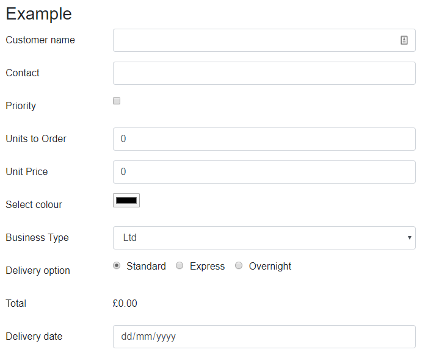

# BlazorFormLayout
Helper components for rendering form content in Blazor using Bootstrap v4

## Todo

- [x] check binding
- [x] re-enable other types
- [x] fix date binding for unset dates
- [x] create a group which has no validation?
- [x] fix `BsDropDown` on _Cost region_
- [x] clean up test code
- [ ] update docs
- [ ] add more example pages for the different components
- [ ] page showing `BsGroup` and `BsValidatedGroup` examples
- [ ] add nuget package publishing to the build process
- [ ] add to awesome-blazor list of packages

## Overview

When creating forms in web applications using Bootstrap, I find all the boiler-plate HTML required to be 
largely repetitive and tedious. With the Razor component model in Blazor we can create components to hide 
away all that tedious nested HTML `div` tags and focus on the fields. The BlazorFormLayout library enables
this.

### Example
This code creates a Bootstrap form with several bound fields.
```html
<EditForm Model="model">
  <BsLayout Orientation="Orientation.Horizontal">
    <BsText @bind-Value="model.Name" Label="Customer name" >
    <BsText @bind-Value="model.Contact" Label="Contact" >
    <BsCheckbox @bind-Value="model.IsPriorityCustomer" Label="Priority" />
    <BsNumber @bind-Value="model.Units" Label="Units to Order" />
    <BsNumber @bind-Value="model.Price" Label="Unit Price" />
    <BsGroup Label="Select colour">
      <input type='color' @bind="model.FavouriteColour" />
    </BsGroup>
    <BsDropdownEnum @bind-Value="model.CustomerType" @options="CustomerTypeList" Label="Business Type" />
    <BsStaticText Value="@model.Total.ToString("c")" Label="Total" />
    <BsDate @bind-Value="model.DeliveryDate" Label="Delivery date" />
  </BsLayout>
</EditForm>
```
The rendered form looks like this:


## Getting Started

See the [Getting Started](docs/GettingStarted.md) section of the documentation

## Documentation

[Table of Contents](docs/_Contents_.md)